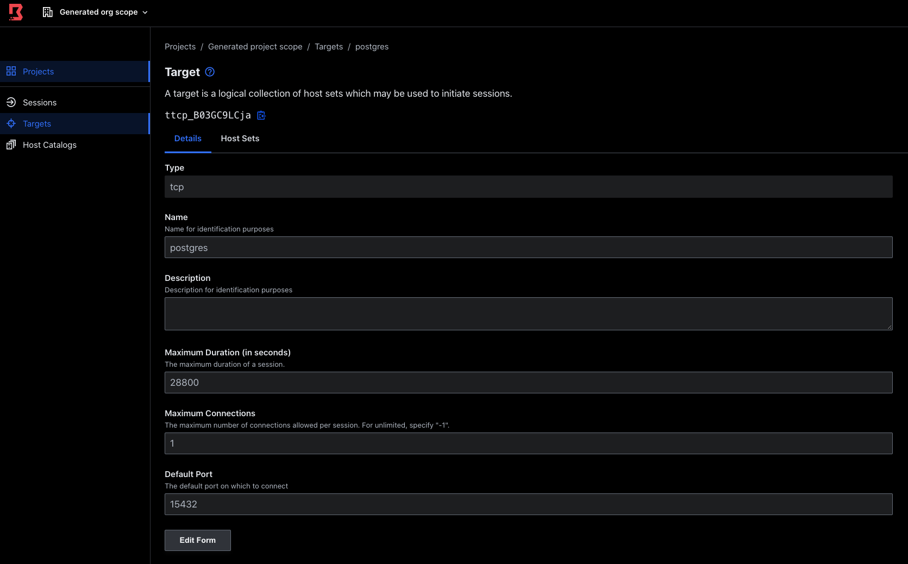
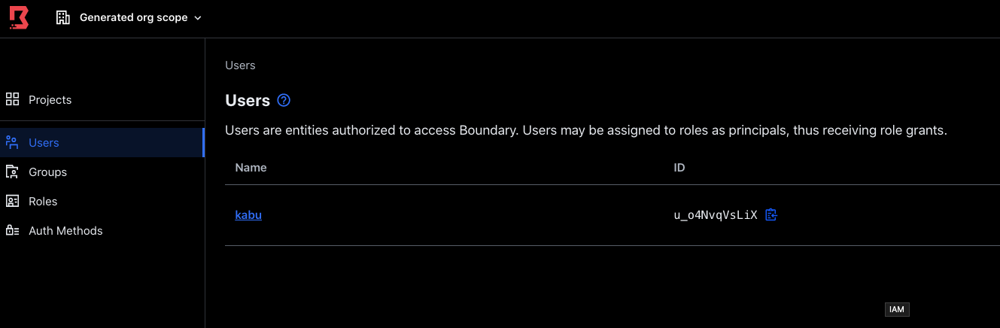
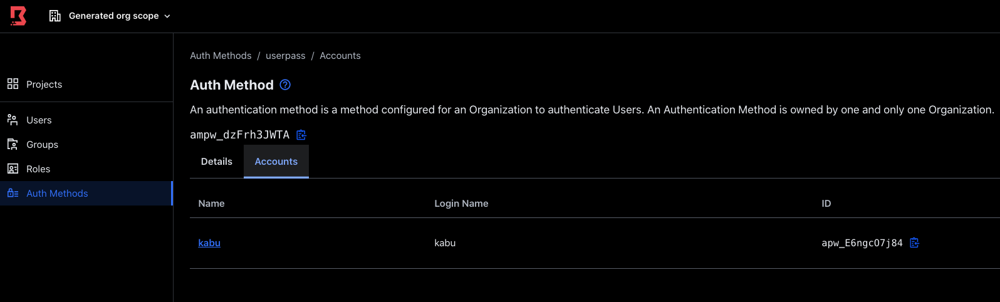

## run target
```
docker run --rm -d \
    -p 15432:5432 \
    -v postgres-tmp:/var/lib/postgresql/data \
    -e POSTGRES_HOST_AUTH_METHOD=trust \
    postgres:12-alpine
``` 

## setup boundary






## test
```shell script
BOUNDARY_CONNECT_USERNAME=postgres
boundary authenticate password \
         -login-name=kabu \
         -password=kabupass \
         -auth-method-id=ampw_dzFrh3JWTA

boundary connect postgres -target-id=ttcp_B03GC9LCja

boundary authenticate password \
         -login-name=admin \
         -password=password \
         -auth-method-id=ampw_1234567890

boundary connect postgres -target-id=ttcp_B03GC9LCja
```